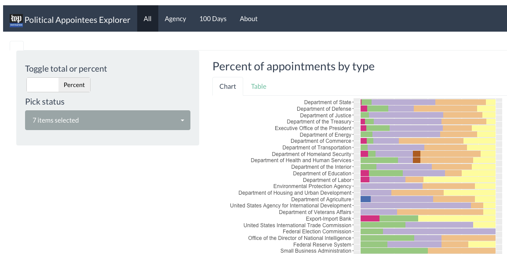
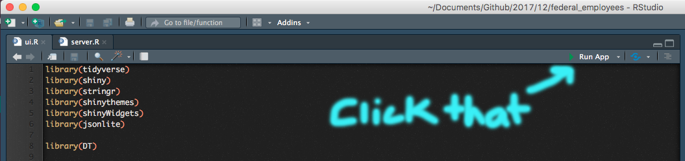

[This data is published under an [Attribution-NonCommercial-ShareAlike 4.0 International (CC BY-NC-SA 4.0) license](https://creativecommons.org/licenses/by-nc-sa/4.0/)]

# Political Appointees Explorer

# How to run

* Download this `federal_employees` repo
* Open the [server.R file](server.R) or [ui.R file](ui.R) in [RStudio](https://www.rstudio.com/products/rstudio/download/#download) ([R](https://cran.rstudio.com/) needs to be previously installed)
* Click **Run App**

